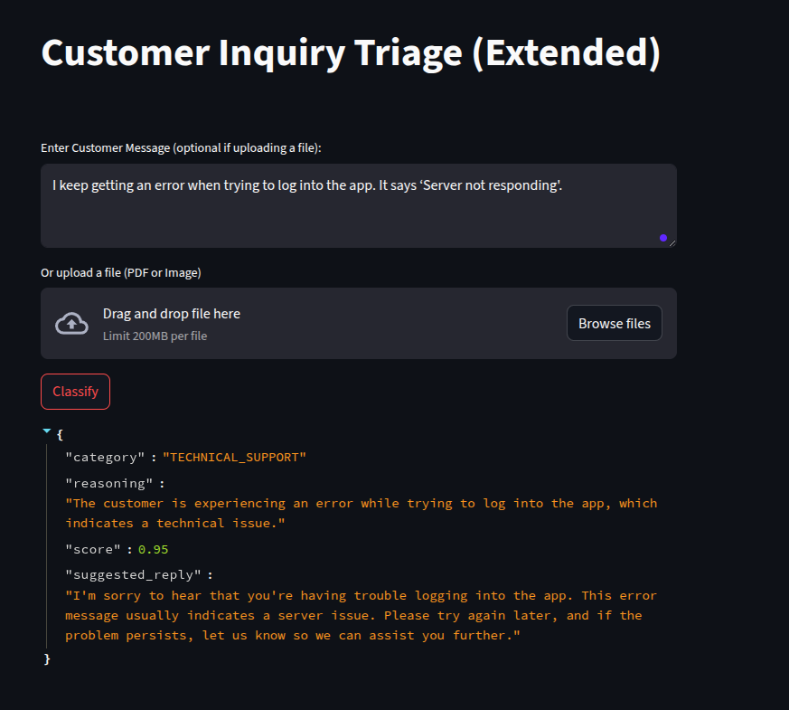
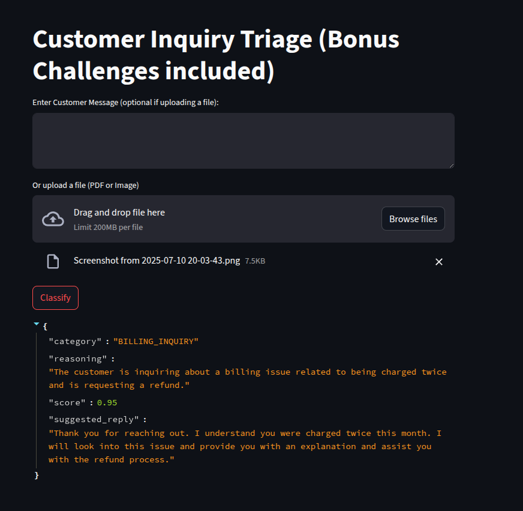
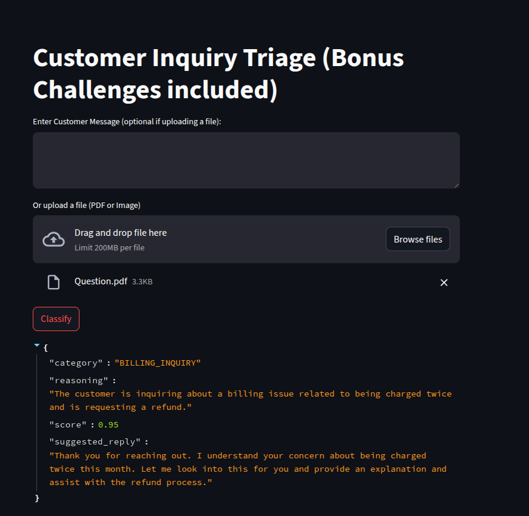

#  Customer Inquiry Triage System (With bonus challenges included)

This project is a smart AI-powered triage service designed to help customer support teams automatically classify incoming messages into appropriate categories such as `TECHNICAL_SUPPORT`, `BILLING_INQUIRY`, or `SALES`. It leverages Large Language Models (LLMs) and supports file uploads (PDFs/images), dynamic categories, suggested replies, and a provider-agnostic architecture.

---

##  Features

-  **LLM-Based Classification** using OpenAI GPT-4o-mini.
-  **Dynamic Category Scalability** via `categories.json`.
-  **Suggested Customer Replies** generated by the LLM.
-  **Multi-Modal Support**: Extracts text from uploaded PDFs and images.
-  **Streamlit Frontend** and FastAPI Backend.
-  **LLM Provider Abstraction** for future compatibility.

---

##  Setup and Running the Project

### 1. Clone the Project or Unzip

```bash
git clone https://github.com/zedekiah85/caava-ai-assignment.git
cd customer-triage-llm-extended
```

Or unzip the provided ZIP file.

---

### 2. Set Your OpenAI API Key

Create a `.env` file and add your OpenAI API key:

```
OPENAI_API_KEY=your_openai_api_key_here
```

---

### 3. Install Dependencies

Optional but recommended, create and activate virtual environment, then continue installing dependencies.

```bash
python3 -m venv env
source env/bin/activate
```

```bash
pip install -r requirements.txt
```

---

### 4. Run the FastAPI Backend

```bash
uvicorn main:app --reload
```

This will run the backend on `http://127.0.0.1:8000`.

---

### 5. Run the Streamlit Frontend

In another terminal:

```bash
streamlit run app.py
```

Visit `http://localhost:8501` in your browser to use the UI.

---

## Design Choices & Trade-Offs

###  **LLM Provider Abstraction**
- **Choice**: We implemented a `llm_providers.py` module with an `OpenAIProvider` class.
- **Trade-off**: Currently supports only OpenAI but easily extendable to Gemini, Claude, or open-source models using the same interface.

###  **Dynamic Categories**
- **Choice**: Categories are defined in a separate `categories.json` file.
- **Benefit**: Allows category edits without changing code.
- **Trade-off**: Currently loaded at startup; live reloading not implemented.

###  **Multi-Modal Support**
- **Choice**: Used `PyMuPDF` for PDFs and `pytesseract` for images.
- **Trade-off**: Requires additional dependencies; OCR quality may vary based on image clarity.

###  **Suggested Replies**
- **Choice**: LLM generates helpful responses to inquiries.
- **Benefit**: Reduces load on support agents by pre-filling responses.
- **Trade-off**: Not guaranteed to be 100% accurate without a human check.

---

##  Future Improvements

If given more time, here's how the service can be improved:

1. **Provider-Agnostic Toggle**: Allow users to select preferred LLM provider (e.g., OpenAI, Gemini, Mistral).
2. **Knowledge Base Integration**: Use a vector DB (like FAISS or ChromaDB) to retrieve previous answers or documents.
3. **Response Feedback Loop**: Let agents rate or edit the response and use feedback to fine-tune the model.

---

##  Project Structure

```
customer-triage-llm-extended/
│
├── main.py               # FastAPI backend
├── app.py                # Streamlit frontend
├── llm_providers.py      # LLM abstraction layer
├── categories.json       # Configurable categories
├── requirements.txt      # Python dependencies
├── README.md             # Project documentation
└── .env                  # API keys (excluded from version control)
```

---


## Challenge
While using this system you may face a challenge with classifying an uploaded image, solution is to check if tesseract-ocr is installed, if not go ahead and install it using the following command and it will work.

```bash
sudo apt install tesseract-ocr
```

## Sample results





## 🧑‍💻 Author

Developed by Zedekiah Ambogo, as part of the Caava VantagePoint AI Software Developer Assessment.
